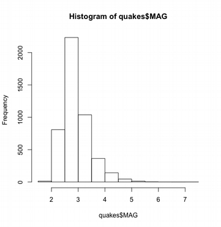
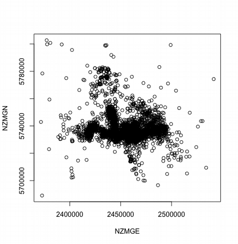

#### GISC 422 T1 2019
# Introducing *R* and *RStudio*
The data for this lab are in [this file](https://raw.githubusercontent.com/DOSull/GISC-422/master/labs/week-1/earthquakes.csv).

There are two versions of this file. The plain Markdown `.md` file can be viewed on github; the R Markdown `.Rmd` can be used in *RStudio*.

## Introduction
This lab will introduce you to the statistical analysis and programming environment *R*, running in *RStudio* (which makes it a bit easier to deal with). *R* has become one of the standard tools for statistical analysis particularly in the academic research community, but [increasingly also in commercial and other work settings](https://statfr.blogspot.com/2018/08/r-generation-story-of-statistical.html). It is well suited to this environment for a number of reasons, particularly

1. it is free [as in beer];
2. it is easily extensible; and
3. because of 1 and 2, many new methods of analysis first become available in *packages* contributed to the *R* ecosystem by researchers in the field.

The last point is why we are using *R* for spatial analysis as part of this course.

Like any good software, versions of R are available for MacOS, Windows and Linux so you can install a copy on your own computer and work on this lab in your own time---you don't need to be at the timetabled lab sections to complete the assignment, although you will find it helpful to attend to get assistance from the course instructors, and also from one another. To get up and running on your own computer, you will need to download and install *R* itself, from [here](http://cran.r-project.org/) and also, optionally, (**but highly recommended**) install *RStudio* from [here](http://www.RStudio.com/products/RStudio/download/).


Installation is pretty straightforward on all platforms. When you are running *R* you will want a web connection to install any additional packages called for in lab instructions below. You will also find it useful to have a reasonably high resolution display (an old 1024&times;768 display will not be a lot of fun to work on, but high pixel density modern displays, such as 4K, can be a bit painful also, without tweaking the display settings). For this reason, if no other, you may find it good to work on the lab machines.

### *DON'T PANIC!*
This lab introduces *R* by just asking you to get on with it, without stopping to explain too much, at least not at first. This is because it's probably better, to just do things with *R* to get a feel for what it's about without thinking too hard about what is going on; kind of like learning to swim by jumping in at the deep end. You may sometimes feel like you are drowning. Try not to worry too much and stick with it, and bear in mind that the assignments will not assume you are some kind of *R* guru (I'm no R guru, I know enough to be dangerous, but am only just competent). Ask questions, confer with your fellow students, consult Google (this [cartoon](https://xkcd.com/627/) is good advice).

## Getting started with R
We're using *R* inside a slightly friendlier 'front-end' called *RStudio*, so start that program up in whatever platform you are running on. You should see something like the display below (without all the text which is from an open session on my machine).


I have labeled four major areas of the interface, these are

+ **Console** this is where you type commands and interact directly with the program
+ **Scripts and other files** is where you can write *scripts* which are short programs consisting of a series of commands that can all be run one after another. This is more useful as you become proficient with the environment, but if you have previous programming experience you may find it useful. You can also get tabular views of open datasets in this panel. Note that this window may not appear, particularly at initial startup, in which case the console will extend the whole height of the window on the left.
+ **Environment/History** here you can examine the data currently in your session (*environment*) more closely, or if you switch to the history tab, see all the commands you have issued in the session.
+ **Various outputs** are displayed in this area – mostly these will be plots, but perhaps also help information about commands.

Before going any further, it makes sense to do some clearing out, since the lab machines are shared computers, there may be data sitting around from the previous session. Use the 'broom' buttons in the **Environment** and **Output** panes to clear these out. Clear the console of previous commands by clicking in the console and selecting **Edit – Clear Console** and then click the X buttons on any open files or datasets in the upper left pane. Alternatively **Session - New Session** will accomplish the same thing.

Now you have cleaned house, we are ready to go.

### Meet the command line...
The key thing to understand about *R* is that it is a command line driven tool. That means you issue typed commands to tell *R* to do things (this was a normal way to interact with a computer and get work done before the early 1990s, and is making a comeback, like vinyl, but even geekier). There are some menus and dialog boxes in *RStudio* to help you manage things, but mostly you interact with *R* by typing commands at the `>` prompt in the console window. To begin, we'll load up a dataset, just so you can see how things work and to help you get comfortable. As with most computer related stuff, you should experiment: you will learn a lot more that way.

First, open up a data file. Go to the **Environment** tab (upper-right panel) and click on **Import Dataset**. Select the **From Text (readr)** option and navigate to the [earthquakes.csv](https://raw.githubusercontent.com/DOSull/GISC-422/master/labs/week-1/earthquakes.csv) file provided.

In the window that appears navigate to the file provided. You will get a preview of the data that is to be imported. You have some options at this point. One that is worth setting is the *Name* of the variable that these data will be imported to. Since you may be typing it a lot, you might want to set a shorter name than the default choice, such as 'quakes'. Then click **Import** to open it. A references to the dataset should appear in the **Environment** pane, and also a table view of it in the upper left pane.

These are data concerning earthquakes recorded in the months after the 7.1 earthquake in Christchurch in September 2010.

When you click Import you will see lines appear in the console, something like

    > View(quakes)
    > library(readr)
    > quakes <- read_csv("path_to/earthquakes.csv")
    Parsed with column specification:
    cols(
    CUSP_ID = col_integer(),
    NZMGE = col_integer(),
    NZMGN = col_integer(),

[There will be more than this snippet.]

You should see also see a data table appear in the upper left panel. The data appear very similar to a spreadsheet. In *R*, data tables are known as *dataframes* and each column is an attribute or variable. The various variables that appear in the table are

+ `CUSP_ID` a unique identifier for each earthquake or aftershock event
+ `NZMGE` and `NZMGN` are New Zealand Map Grid Easting and Northing coordinates
+ `ELAPSED_DAYS` is the number of days after September 3, 2010, when the big earthquake was recorded
+ `MAG` is the earthquake or aftershock magnitude
+ `DEPTH` is the estimate depth at which the earthquake or aftershock occurred
+ `YEAR`, `MONTH`, `DAY`, `HOUR`, `MINUTE`, `SECOND` provide detailed time information

Now, if we want to use *R* to do some statistics, these data are stored in a variable named `quakes` (in my example, you may have called it something different). I can refer to columns in the dataframe by calling them `quakes$MAG` (note the $ sign). So for example, if I want to know the mean magnitude of the aftershocks in this dataset I type
```{r}
mean(quakes$MAG)
```
or the mean northing coordinate
```{r}
mean(quakes$NZMGN)
```
and *R* will return the value in response. Probably more informative is a boxplot or histogram, try:
```{r}
boxplot(quakes$MAG)
```
or
```{r}
hist(quakes$MAG)
```
and you should see statistical plots similar to those shown below.



It gets tedious typing `quakes` all the time, so you can `attach` the dataframe so that the variable names are directly accessible without the `quakes$` prefix by typing
```{r}
attach(quakes)
```
and then
```{r}
hist(MAG)
```
will plot the specified variable. Be careful using attach as it may lead to ambiguity about what you are plotting if you are working with different datasets that include variables with the same names.

Try the above commands just to get a feel for things.

You can make a simple map of all the data by plotting the `NZMGE` variable as the *x* (i.e. horizontal axis) and `NZMGN` as the *y* axis of a scatterplot:
```{r}
plot(NZMGE, NZMGN)
```


Because *R* is not a GIS it doesn't know about things like projections, so this is a very crude map. For example, if you resize the plot window it independently rescales the east-west and north-south directions, which is not helpful for a map. To prevent it doing this we can specify an option to the plot command requiring the aspect-ratio to be fixed at 1:
```{r}
plot(NZMGE, NZMGN, asp=1)
```
There are *R* packages to handle geographical data better than this (we will look at those in the next lab) but for now don't worry about it too much. To see if there is a relationship between earthquake depth and magnitude, try this
```{r}
plot(DEPTH, MAG)
```
and because *R* is a statistics package, we can easily fit and plot a simple linear regression model to the data
```{r}
regmodel <- lm(MAG ~ DEPTH)
abline(regmodel, col='red')
```
Note here the use of `<-` to assign the model, made by the *linear model* `lm()` command to a new variable, called `regmodel`. You can get more details of this model by typing `regmodel` or `summary(regmodel)`. If you know anything about regression models, these may be of interest to you. Also note how, I've requested that the line be plotted in red `(col='red')`, so it can be seen more easily.

We can make more complex displays. For example
```{r}
plot(ELAPSED_DAYS, MAG)
```
Shows how the magnitude of the aftershocks changed in the days after the initial large earthquake, with the second large event happening around 6 months (180 days) later. A more complicated plot still would be
```{r}
boxplot(MAG ~ cut(ELAPSED_DAYS, seq(0,200,20)))
```
Give that a try and see what you get. To label the chart more informatively we need to add information for *x* and *y* axis labels
```{r}
boxplot(MAG ~ cut(ELAPSED_DAYS, seq(0,200,20)), xlab="Days after Sept 3, 2010", ylab="Magnitude")
```
The aim here is just to get a feel for things. Don't panic if you don't completely understand what is happening. The important thing is to realize

+ You make things happen by typing commands in the console
+ Commands either cause things to happen (like plots) or they create new variables (data with a name attached), which we can further manipulate using other commands. Variables and the data they contain remain in memory (you can see them in the **Environment** tab) and can be manipulated as required.
+ *RStudio* remembers everything you have typed (check the **History** tab if you don't believe this!)
+ All the plots you make are also remembered (mess around with the back and forward arrows in the plot display).

The **History** tab is particularly useful. If you want to run a command again, find it in the list, select it and then select the **To Console** option (at the top). The command will appear in the console at the current prompt, where you can edit it to make any desired changes and hit `<RETURN>` to run it again. You can also get the same history functionality using the up arrow key in the console, which will bring previous commands back to the console line for you to reuse. But this gets kind of annoying once you have run many commands.

Another way to rerun things you have done earlier is to save them to a script. The easiest way to do this is to go to the history, select any commands you want, and then select **To Source**. This will add the commands to a new file in the upper left panel, and then you can save them to a `.R` script file to run all at once. For example, in the history, find the command used to open the data file, then the one used to attach the data, then one that makes a complicated plot. Add each one in turn to the source file (in the proper order). Then from the scripts area, select **File – Save As...** and save the file to some name (say `test.R`). What you have done is to write a short program! To run it go to **Code – Source File...** navigate to the file, and click **OK**. All the commands in the file should then run in one go.

### Additional resources
*R* is really a programming language as much as it is a piece of software, there is a lot more to learn about it than is covered here, or will be covered in this course. If you want to know more about *R* as a general statistics environment there is a [good online guide here](https://cran.r-project.org/doc/contrib/Verzani-SimpleR.pdf) which is worth looking at if you want a more detailed introduction.

For the purposes of this course, the commands you really need to get a handle on are explored in the corresponding weekly labs.
